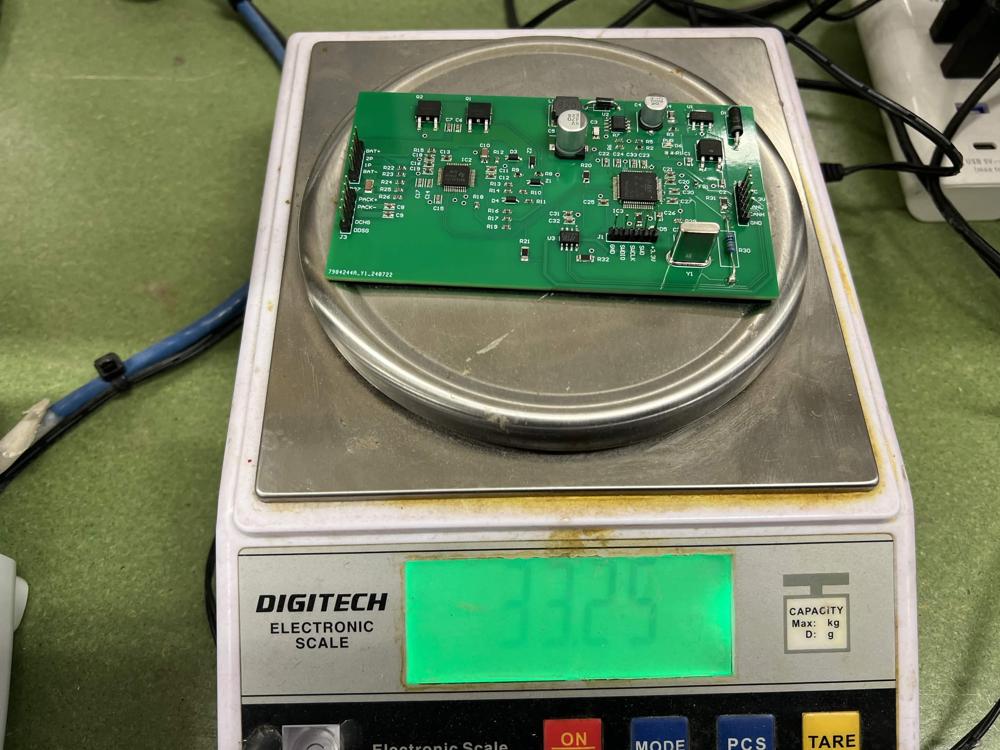
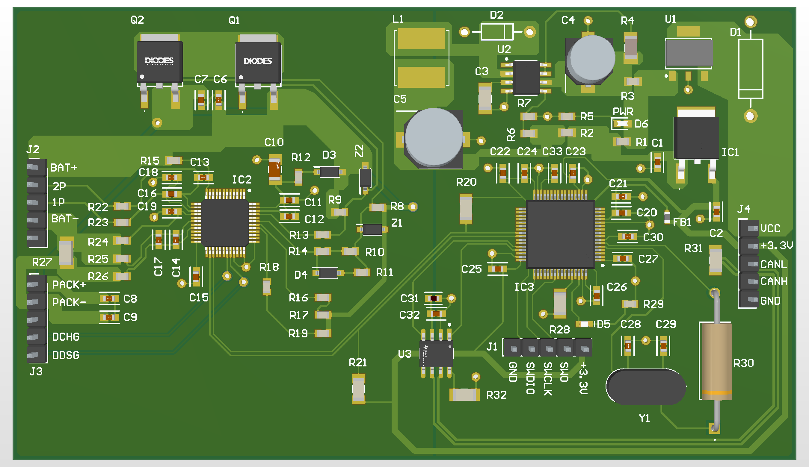
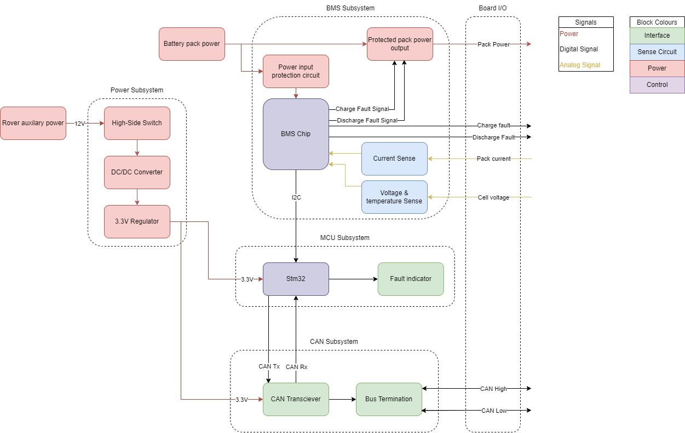

# BMS-PCB

### Overview
The BMS PCB is a lightweight (33.25g), compact (66.04mm x 114.30mm) prototype board designed to address the challenges of safely using lithium-based batteries in aerospace applications, such as extraterrestrial rovers.

*Finished BMS Board and its Weight*

*3D Render of the PCB*

### High-Level Block Diagram

The board consists of a single two-layer PCB that integrates power circuitry, battery management ICs, an STM32 microcontroller, and a CAN communication interface. It is designed to efficiently manage lithium-ion, lithium-polymer, and LiFePO4 battery chemistries.
